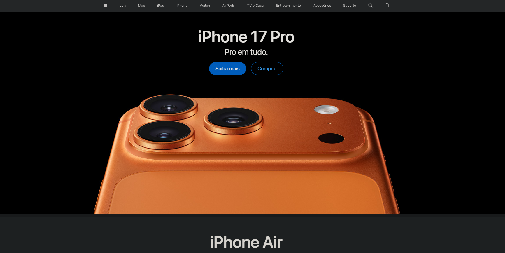

# Plataforma de Sentimentos
## **Brainstorming**

- **APIs de redes sociais, para a coleta de dados**
	- Reddit
	- 4Chan
	- X (Twitter)
	- Instagram
	- Discord
	- Facebook
	- Snapchat
	- Tiktok
	- Kwai
	- Pinterest
	- LINE
	- WeChat
- Dashboards com os dados, separados por abas de diferentes redes sociais
- Pesquisa por tópico nas redes sociais específicas

### **Estilo da plataforma**

- Design simples e objetivo
	- e.g. Apple, Instagram...

---

- Cores gerais simples (tons acinzentados), dando ênfase às redes sociais e aos dashboards (tons mais chamativos)

### **Requisitos básicos**

- Cadastro na plataforma
	- Isso pode ser usado também para a coleta de dados da nossa própria plataforma (e.g. O que nossos usuários mais pesquisam...)
- Feedback sobre a plataforma